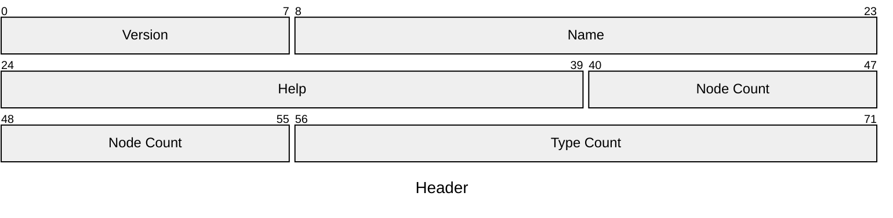

# `.ana` File Format Specification

> Written by: [nukkeldev](https://github.com/nukkeldev) \
> Version: `0x01` ([History](#version-history))

## Introduction

`.ana` files store parsing node graphs and, optionally, positional information for the nodes. The format is optimized to be as compact as possible while allowing for the maximum amount of flexibility.

## Definitions

- `Parsing Graph` / `Parsing Node Graph` - The collection of validly connected nodes.
- `Node` - An instance of a node type in the parsing graph.
- `Type` / `Node Type` - Either a `std` or user defined description of a node. `std` nodes are inbuilt and are hardcoded in the program.

## Format

> ### Notation
>
> - All hardcoded strings are UTF8 encoded
> - The sizes of fields are specified in [*brackets*] after the field name
>   - Non-byte aligned bitfields are packed with the surrounding bytes, no bits are wasted
>   - All fields are **little endian** when applicable
> - Special Types
>   - [`#<identifier>`] - value of `identifier` as bytes
>   - [`&str`] - `u16` pointer to a string in the **Strings** section

All `.ana` files must start with the byte sequence `[41, 4e, 4c, 47]` ("ANLG"). The below sections are then appended without padding.

### Header [9 bytes]

The **Header** contains various information about the `.ana` file. It contains the following (in order):

- `.ana` Version [`u8`]
  - Corresponds to the spec version (`0x01`)
- Name [`&str`]
  - A short title for this parsing node
- Help [`&str`]
  - Help text for how to use this node
- Node Count [`u16`]
  - The number of nodes present in this graph
- Type Count [`u16`]
  - The number of types present in this graph

### Nodes

The **Nodes** contain the majority of the file. This section is a unpadded map of nodes, correlated by node id.

- Table
  -
- Node Id [`u16`]
  - A unique id for this node

## Appendix

### Example Files

### Version History

#### Version 0x01

> Written: `12/1/2024` - `TBD`

The first version of the `.ana` specification. This was written largely before much of anything has been programmed and served as a design document for the software as well.
