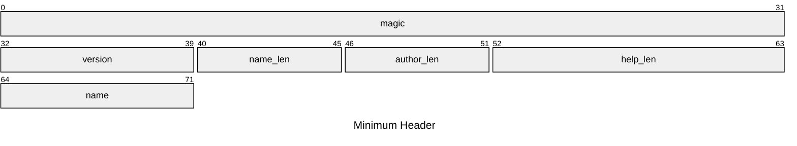

# `.ana` File Format Specification

> Written by: [nukkeldev](https://github.com/nukkeldev) \
> Version: `0` ([History](#version-history))

- [`.ana` File Format Specification](#ana-file-format-specification)
  - [Introduction](#introduction)
  - [Format](#format)
    - [Header](#header)
    - [Type Map](#type-map)
    - [Nodes](#nodes)
      - [Node](#node)
    - 
  - [Appendix](#appendix)
    - [Example Files](#example-files)
    - [Version History](#version-history)
      - [Version 0](#version-0)

## Introduction

> [!NOTE] Motivation
> Throughout the writing process, prior to much of the development work towards `Analogue` itself,
> it was evident that the structure of `.ana` files will dictate much of the performance and 
> quality-of-life decisions throughout the library and editor. With that in mind, this initial version
> of the specification hopes to serve a solid foundation for Analogue, as well as later versions of this format.

`.ana` files describe the state of a **parsing graph** in Analogue. [TODO]

## Format

> [!NOTE] Data Types
> | Identifier | Size                  | Description                   |
> | :--------: | --------------------- | ----------------------------- |
> |   `u#N`    | `N` bits              | `N`-bit unsigned number       |
> |  `T[N?]`   | `N` * size of `T`     | `N` values of `T`             |
> |   `bool`   | `1` bit               | `0` (`false`) or `1` (`true`) |
> | `str<u#N>` | `N` bit + `u#N` bytes | `0` (`false`) or `1` (`true`) |

### Header

**Minimum Size**: `9` bytes

|     Name     | Type             | Description                                                                                  |
| :----------: | ---------------- | -------------------------------------------------------------------------------------------- |
|   `magic`    | `4u8`            | Byte sequence to signify that this is a `.ana` file. Value must be utf-8 encoded **"ANLG"**. |
|  `version`   | `1u8`            | The `.ana` version; corresponds to the specification version.                                |
|  `name_len`  | `u6`             | The length of the `name` field in bytes - `1`; **Limited to 2^6 (64) bytes of characters.**  |
| `author_len` | `u6`             | The length of the `author` field in bytes; **Limited to 2^6 - 1 (63) bytes of characters.**  |
|  `help_len`  | `u12`            | The length of the `help` field in bytes; **Limited to 2^12 - 1 (4095) bytes of characters.** |
|    `name`    | `u8[name_len+1]` | The display name of this parsing graph;  **At least one character.**                         |
|   `author`   | `u8[author_len]` | The author of this parsing graph.                                                            |
|    `help`    | `u8[help_len]`   | Help text for the usage of this graph.                                                       |

### Type Map

**Minimum Size**: `4` bytes

|     Name     | Type                  | Description                                                                                             |
| :----------: | --------------------- | ------------------------------------------------------------------------------------------------------- |
|    `size`    | `u16`                 | The size of this section in bytes.                                                                      |
| `type_count` | `u16`                 | The number of types mapped.                                                                             |
|  `offsets`   | `u16[type_count]`     | Byte offsets from the byte after this field to the mapped type string with the `type_id` as it's index. |
|   `types`    | `str<u8>[type_count]` | Absolute type string associated with indices.                                                           |

### Nodes

**Minimum Size**: `_` bytes

|     Name     | Type               | Description                                                                               |
| :----------: | ------------------ | ----------------------------------------------------------------------------------------- |
|    `size`    | `u32`              | The size of this section in bytes.                                                        |
| `node_count` | `u16`              | The number of nodes.                                                                      |
|  `offsets`   | `u16[node_count]`  | Byte offsets from the byte after this field to the node with the `node_id` as it's index. |
|   `nodes`    | `Node[node_count]` | Node instance associated with indices.                                                    |

#### Node

**Minimum Size**: `_` bytes

|     Name     | Type               | Description                                                                               |
| :----------: | ------------------ | ----------------------------------------------------------------------------------------- |
|    `size`    | `u32`              | The size of this section in bytes.                                                        |
| `node_count` | `u16`              | The number of nodes.                                                                      |
|  `offsets`   | `u16[node_count]`  | Byte offsets from the byte after this field to the node with the `node_id` as it's index. |
|   `nodes`    | `Node[node_count]` | Node instance associated with indices.                                                    |

###

## Appendix

### Example Files

### Version History

#### Version 0

> Written: `12/3/2024` - `TBD`