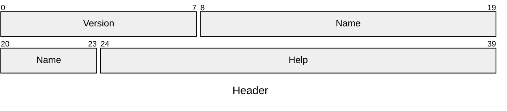

# `.ana` File Format Specification

> Written by: [nukkeldev](https://github.com/nukkeldev) \
> Version: `0x01` ([History](#version-history))

- [`.ana` File Format Specification](#ana-file-format-specification)
  - [Introduction](#introduction)
  - [Definitions](#definitions)
  - [Format](#format)
    - [Header \[5 bytes\]](#header-5-bytes)
    - [Nodes](#nodes)
    - [Builtins](#builtins)
  - [Appendix](#appendix)
    - [Example Files](#example-files)
    - [Version History](#version-history)
      - [Version 0x01](#version-0x01)

## Introduction

`.ana` files store parsing node graphs and, optionally, positional information for the nodes. The format is optimized to be as compact as possible while allowing for the maximum amount of flexibility.

## Definitions

- `Parsing Graph` / `Parsing Node Graph` - The collection of validly connected nodes.
- `Node` - An instance of a node type in the parsing graph.
- `Type` / `Node Type` - Either a `std` or user defined description of a node. `std` nodes are inbuilt and are hardcoded in the program.

## Format

> ### Notation
>
> - All hardcoded strings are UTF8 encoded
> - The sizes of fields are specified in [*brackets*] after the field name
>   - Non-byte aligned bit-fields are packed with the surrounding bytes, no bits are wasted
>   - All fields are **little endian** when applicable
> - Special Types
>   - [`#<identifier>`] - value of `identifier` as bytes
>   - [`*<identifier>`] - repeat value of `identifier` times
>   - [`&str`] - `u16` pointer to a string in the **Strings** section, `0xFFFF` signifies an empty string

All `.ana` files must start with the byte sequence `[41, 4e, 4c, 47]` ("ANLG"). The below sections are then appended without padding.

### Header [5 bytes]

The **Header** contains various information about the `.ana` file. It contains the following (in order):

- `.ana` Version [`u8`]
  - Corresponds to the spec version (`0x01`)
- Name [`&str`]
  - A short title for this parsing node
- Help [`&str`]
  - Help text for how to use this node

### Nodes

The **Nodes** section is a unpadded list of nodes, indexed by node id. It is `header.section_sizes.nodes` bytes long.

- Node Map
  - Node Count [`u16`]
    - The number of nodes in this parsing graph
  - Nodes [`*node_count`]
    - Id [`u16`]
      - A unique id for the node. Ids are contiguous and when one node is deleted all other nodes are re-id'd if necessary.
    - Node Type
      - If the first byte is `0x00`, this node is `builtin` and the next byte indicates the `builtin` id (see the [builtins](#builtins) table).
      - Otherwise, the following two bytes 
    - Port Configuration
      - 

### Builtins

## Appendix

### Example Files

### Version History

#### Version 0x01

> Written: `12/1/2024` - `TBD`

The first version of the `.ana` specification. This was written largely before much of anything has been programmed and served as a design document for the software as well.
